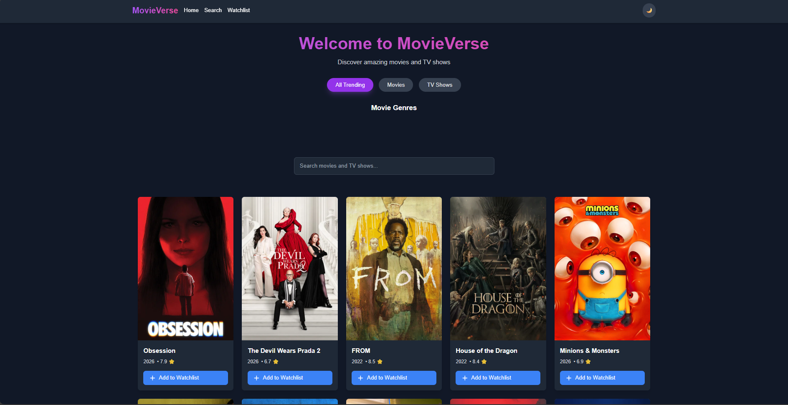
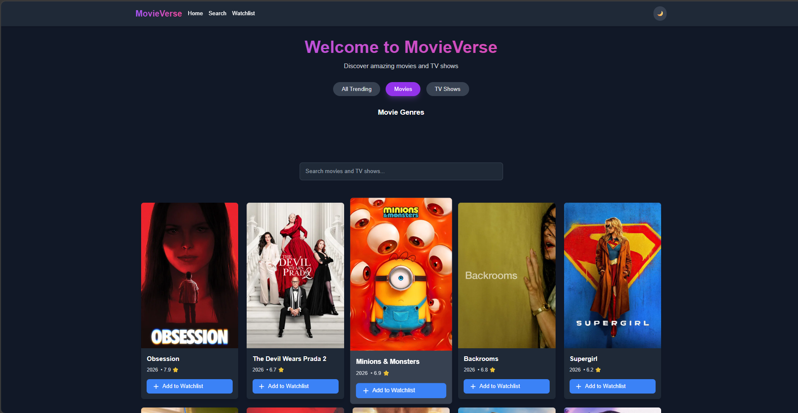
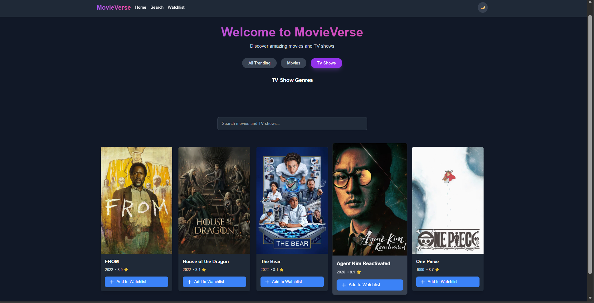
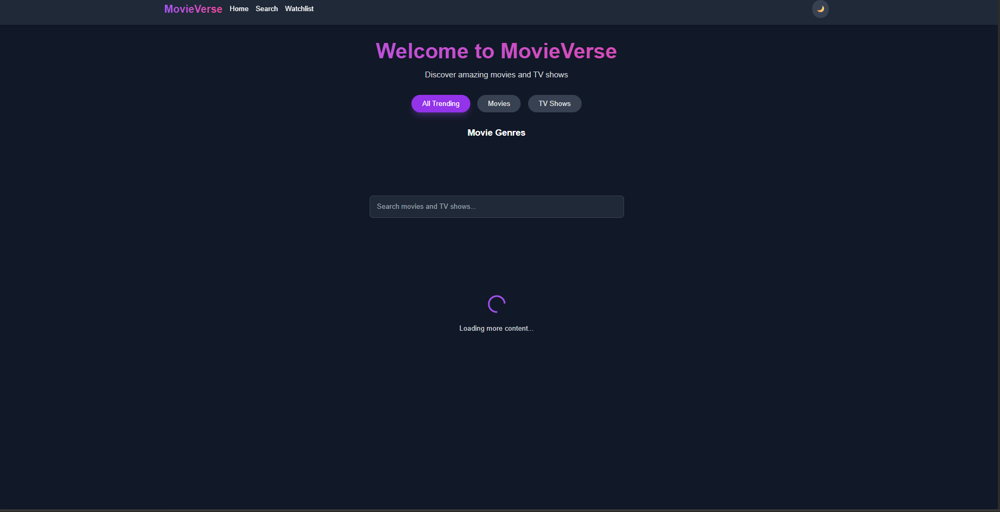

# MovieVerse

MovieVerse is a responsive web application that allows users to discover, explore, and manage their favorite movies and TV shows. It integrates with The Movie Database (TMDB) and the Open Movie Database (OMDB) to provide detailed information, real-time search, and a personalized experience through a watchlist feature.

## Features

- Search for movies and TV shows with real-time results from TMDB API
- View detailed information including title, plot, cast, release date, ratings, and poster
- Add or remove movies and shows from a personal watchlist
- Browse trending content by category or genre
- Toggle between light and dark themes
- Ratings integration from TMDB, IMDb, and Rotten Tomatoes
- Infinite scroll / continuous loading of movies as the user scrolls

## Technologies Used

- React (with Hooks)
- Next.js 
- Tailwind CSS
- TMDB API
- localStorage (for storing watchlist and preferences)
- Git & GitHub for version control and code review

## Tech Stack

### Frontend (Next.js / React)

* Next.js (React framework)
* React functional components
* React Hooks (useState, useEffect, useCallback, useRef)
* Client-side routing (Next.js pages router)
* Dynamic rendering
* Conditional rendering
* Infinite scrolling (Intersection Observer / scroll event-based fetching)
* API data fetching using fetch / Axios
* Environment variables (NEXT_PUBLIC_*)
* CSS Modules / Tailwind CSS (if applicable)

### Backend (Node.js)

* Node.js
* Express.js
* REST API architecture
* dotenv for environment management
* CORS middleware
* Helmet for security headers
* Morgan for logging

### External API

* TMDB (The Movie Database API)

## Project Structure

````

src/
├── assets/              # Static files and images
├── components/          # Reusable UI components
├── features/            # Feature-specific folders
│   ├── search/
│   ├── movie-details/
│   ├── trending/
│   ├── watchlist/
│   └── theme/
├── pages/               # Route-level components (optional)
├── services/            # API logic (e.g., tmdb.js, omdb.js)
├── utils/               # Utility functions (debounce, formatters, storage)
├── App.jsx
└── main.jsx

````

## Installation & Setup

1. Clone the repository:

````bash
git clone https://github.com/Wambita/Movie-verse.git
cd Movie-verse
````

2. Backend

````
cd backend
npm install
npm run dev
````

3.  Frontend

````
cd frontend
npm install
npm run dev
````


## Environment Variables

### Backend (.env)

```
PORT=3001
```

### Frontend (.env)

```
NEXT_PUBLIC_TMDB_API_KEY=your_api_key
```

## Screenshots


### Home Page (Trending Movies)




### Home Page Movies (Trending Movies)




### Home Page TV Shows (Trending Movies)



### Search Functionality



### Movie Details Page


### Watchlist 


### Light Mode


## Core React Concepts Used

### Component Architecture

* Reusable UI components
* Separation of concerns between UI and data logic

### Hooks

* useState: state management for UI and API data
* useEffect: lifecycle handling for API calls and updates
* useRef: DOM references for scroll tracking / intersection observer
* useCallback: optimization of repeated functions in scroll handlers

### Data Fetching Patterns

* Client-side API requests to backend
* Asynchronous data fetching using async/await
* Pagination or infinite scrolling API strategy
* Debouncing/throttling for search input optimization (if implemented)

### Performance Optimization

* Conditional rendering to reduce unnecessary re-renders
* Efficient API request handling for large datasets

### Routing (Next.js)

* File-based routing system
* Dynamic routes for movie details pages

## API Architecture

Frontend → Backend → TMDB API

* Frontend handles UI rendering and user interaction
* Backend manages API requests securely
* TMDB provides external movie data

## Development Workflow

* Each feature is developed on its own Git branch using a consistent naming convention:

  * `feature/search`
  * `feature/movie-details`
  * `feature/watchlist`
  * `feature/trending`
  * `feature/theme-toggle`

* Descriptive and clear commit messages are used for each change:

  * `feat: add search input with debounce`
  * `fix: handle missing ratings from OMDB`
  * `refactor: extract movie card component`

* After development, feature branches are pushed and opened as pull requests against `main`.

## Contribution Guidelines

* Keep code modular and easy to maintain
* Reuse components where possible
* Handle all API errors gracefully
* Test on mobile and desktop viewports
* Avoid committing `.env` or sensitive information

## API References

* [TMDB API Documentation](https://developer.themoviedb.org/docs)

## License

This project is open-source and available under the MIT License.

## Author
This project was  built and maintained  by **Wambita**
